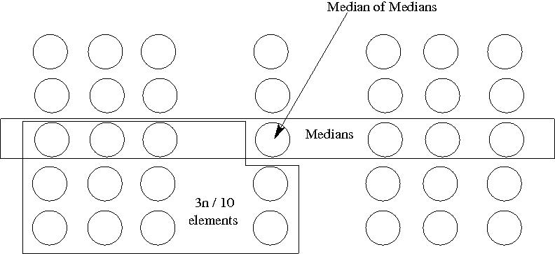

# Intro Select
<table>
    <tr>
        <table>
            <tr>
                <td><strong><i>Class</i></strong></td>
                <td><strong><i>Type</i></strong></td>
                <td><strong><i>Category</i></strong></td>
                <td><strong><i><a href="/DataStructures/">Data Structure</a></i></strong></td>
                <td><strong><i>Space</i></strong></td>
                <td><strong><i>Time: Worst</i></strong></td>
                <td><strong><i>Time: Average</i></strong></td>
            </tr>
            <tr>
                <td><a href="/OrderStatistic/">Order Statistic</a></td>
                <td>Deterministic</td>
                <td>Efficient</td>
                <td>Array</td>
                <td><i>O</i>(n)</td>
                <td><i>O</i>(n)</td>
                <td><i>O</i>(n)</td>
            </tr>
        </table>
    </tr>
    <tr>
        <table>
            <tr style="text-align: center; font-size:20px;">
                <td><strong><i>Image</i></strong></td>
                <td><strong><i>Video</i></strong></td>
            </tr>
            <tr>
                <td style="text-align: center;"></td>
                <td style="text-align: center;"><a href="https://youtu.be/fcf56RTbkHc"></a></td>
            </tr>
        </table>
    </tr>
</table>

# Python Implementation
``` python
def intro_select(ary, i):
    
    def insertion_sort(start, end):
        if end - start < 1: return
        for k in range(start + 1, end + 1):
            key, j = ary[k], k - 1
            while j >= start and ary[j] > key: 
                ary[j+1], j = ary[j], j - 1
            ary[j+1] = key
    
    def median_of_medians(start, end):
        n, remainder = end - start + 1, (end - start + 1) % 5
        if n < 3: return min(ary[start], ary[end])
        for j in range(start + 4, end + 1, 5):
            insertion_sort(j - 4, j)
        medians = [ary[j] for j in range(start + 2, end - remainder, 5)]
        if remainder:
            medians += [ary[end - (remainder // 2)]]
        m = len(medians)
        return intro_select(medians, (m // 2) + (m % 2))
        
    def partition(start, end, median):
        i, j, flag = start - 1, start, True
        while j < end:
            if ary[j] < median:
                i += 1
                ary[i], ary[j] = ary[j], ary[i]
            elif ary[j] == median and flag:
                ary[j], ary[end], j, flag = ary[end], ary[j], j - 1, False
            j += 1
        ary[i+1], ary[end] = ary[end], ary[i+1]
        return i + 1
    
    def recurse(start, end):
        median = median_of_medians(start, end)
        mid = partition(start, end, median)
        if i == mid + 1: return ary[mid]
        elif i < mid + 1: return recurse(start, mid - 1)
        return recurse(mid + 1, end)
    
    n = len(ary)
    if n == 1: return ary[0]
    return recurse(0, n - 1)
```

# Java Implementation
``` java
static int intro_select(int[] ary, int i) {
    return recurse(ary, 0, ary.length - 1, i);
}

static int recurse(int[] ary, int start, int end, int i) {
    int median = median_of_medians(ary, start, end);
    int mid = partition(ary, start, end, median);
    if (i == mid + 1) {
        return ary[mid];
    } else if (i < mid + 1) {
        return recurse(ary, start, mid - 1, i);
    }
    return recurse(ary, mid + 1, end, i);
}

static int median_of_medians(int[] ary, int start, int end) {
    int n = start - end + 1, remainder = (start - end + 1) % 5, i = 0;
    if (n < 3) {
        return Math.min(ary[start], ary[end]);
    }
    for (int j = start + 4; j <= end; j += 5) {
        insertion_sort(ary, j - 4, j);
    }
    int[] medians = new int[(n / 5) + (remainder > 0 ? 1 : 0)];
    for (int j = start + 2; j < end - remainder; j += 5) {
        medians[i++] = ary[j];
    }
    if (remainder > 0) {
        medians[i] = ary[end - (remainder / 2)];
    }
    return select(medians, (medians.length / 2) + (medians.length % 2));
}

static void insertion_sort(int[] ary, int start, int end) {
    if (end - start > 0) {
        for (int k = start + 1; k <= end; k++) {
            int key = ary[k], j = k - 1;
            while (j >= start && ary[j] > key) {
                ary[j+1] = ary[--j];
            }
            ary[j+1] = key;
        }
    }
}

static int partition(int[] ary, int start, int end, int median) {
    int i = start - 1, j = start - 1;
    boolean flag = true;
    while (++j < end) {
        if (ary[j] < median) {
            int temp = ary[++i];
            ary[i] = ary[j];
            ary[j] = temp;
        } else if (ary[j] == median && flag) {
            int temp = ary[j];
            ary[j--] = ary[end];
            ary[end] = temp;
            flag = false;
        }
    }
    int temp = ary[i+1];
    ary[i+1] = ary[end];
    ary[end] = temp;
    return i + 1;
}
```